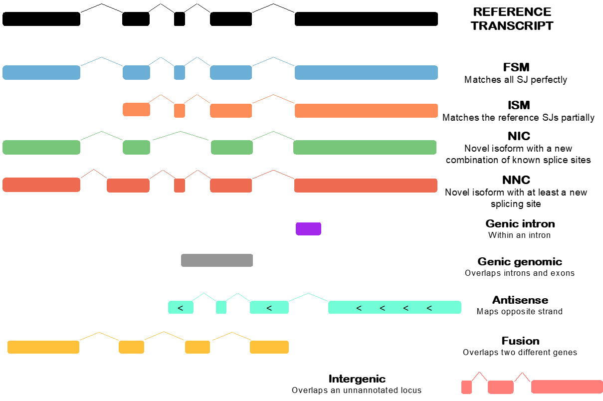
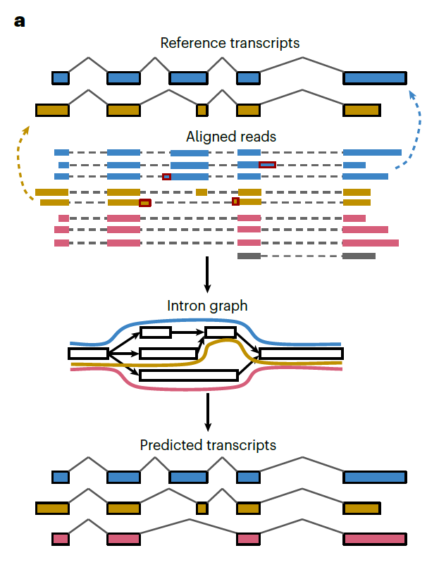

# SQANTI verse tutorial

```bash
git clone https://github.com/ConesaLab/courses-SQANTI_verse.git
```

# Introduction to SQANTI3

**SQANTI3** is a comprehensive bioinformatics tool designed for the quality control, curation, and annotation of long-read transcriptomes. It integrates multiple data sources to enhance the accuracy of transcriptome characterization, making it an essential component of the Functional IsoTranscriptomics framework, alongside tools like IsoAnnot and tappAS. ([GitHub Repository](https://github.com/ConesaLab/SQANTI3))

## Key Features

* **Integration of Diverse Data Types**: SQANTI3 supports the incorporation of various data types, including:

  * Short-read sequencing data
  * CAGE (Cap Analysis Gene Expression) peak sequencing information
  * PolyA motifs and Quant-seq
  * Expression matrices derived from tools like Kallisto
  * Full-length counts from PacBio data

* **Modular Architecture**: The tool is structured into three main modules:

  1. **QC (Quality Control)**: Classifies isoforms based on structural categories.
  2. **Filter**: Applies user-defined criteria to remove potential artifacts.
  3. **Rescue**: Recovers isoforms that may have been erroneously filtered out but have supporting evidence.

## Structural Categories in QC Module

The QC module categorizes isoforms into well-defined structural categories, facilitating a nuanced understanding of transcriptome composition:

<details><summary><strong>🏗️ SQANTI3 Structural Categories</strong></summary>

1. **Full-Splice Match (FSM)**: Isoforms with splice junctions that perfectly match a reference transcript.
2. **Incomplete-Splice Match (ISM)**: Isoforms matching a consecutive subset of splice junctions from a reference transcript.
3. **Novel In Catalog (NIC)**: Isoforms with novel combinations of known splice sites.
4. **Novel Not In Catalog (NNC)**: Isoforms containing at least one novel splice site not present in the reference annotation.
5. **Antisense**: Isoforms aligning to a gene locus but transcribed from the opposite strand.
6. **Fusion**: Isoforms comprising exons from two or more distinct gene loci.
7. **Genic Genomic**: Isoforms located within a gene locus but not reconstructing any known or novel splicing pattern.
8. **Intergenic**: Isoforms aligning to genomic regions outside of any annotated gene.

<div align="center" style="background-color:white;">
  
</div>

</details>

## Course Objectives

Throughout this course, you will gain hands-on experience with SQANTI3's three main modules:

* **QC**: Learn how to classify isoforms and interpret quality descriptors.
* **Filter**: Understand how to apply filtering criteria to refine your transcriptome data.
* **Rescue**: Explore methods to recover valid isoforms that may have been inadvertently excluded.

* **Bonus**: You will also learn how to visualize your results in the UCSC Genome Browser with [SQANTI_browser](https://github.com/ConesaLab/SQANTI-browser), enabling you to explore the genomic context of your isoforms.

By the end of the course, you will be equipped to effectively utilize SQANTI3 for comprehensive transcriptome analysis, integrating various data types to achieve accurate and reliable results.

⚠️ This course has been done using the latest release of SQANTI3 (v6.0).

# 0. Pre-requisites

Before starting the tutorial, it is key to have a clean and organized working environment. The initial step, even before processing any data is to prepare the working environment. In bioinformatics, an organized workspace is vital, so when you come after some time to your project, you can find and understand what you were doing, rather than spend hours searching through weirdly named directories. It is important to always create three directories:

- *scripts*: all the scripts will be stored here, with meaningful names
- *data*: Raw data will go in here and, if you want and need, databases
- *results*: Create a sub directory for every different process you do. If you run a process multiple times with different parameters, include them in the directory name, so you will differentiate them in the future.

```bash
mkdir scripts
mkdir data
```

### Software installation

SQANTI3 can be directly downloaded from GitHub using the following command:

```bash
wget https://github.com/ConesaLab/SQANTI3/releases/download/v6.0-beta/SQANTI3_v6.0.zip
mkdir -p tools/sqanti3
unzip SQANTI3_v6.0.zip -d tools/sqanti3
```

Once it is downloaded and unzipped, you can either add it to your PATH or call the programs using the full path. 

<details>
<summary><strong> 📃  Adding SQANTI3 to your PATH</strong></summary><br>

In the terminal, you have to find the file `.bashrc` or `.bash_profile` in your home directory. Use your favorite text editor to open it and add the following line

```bash
export PATH=$PATH:/path/to/SQANTI3_v6.0
```

Then, save the file and SQANTI3 will be in your path for the next terminal you open. As well, you can make this changes instantaneous by running `source ~/.bashrc` or `source ~/.bash_profile` in the terminal.

Additionally, you could create a symbolic link to the SQANTI3 scripts in a directory that is already in your PATH, such as `/usr/local/bin`:

---
</details><br>

The final step to have a functional sqanti3 installation is to install the dependencies. SQANTI3 has a few dependencies that need to be installed before running the program, but that is all handled by anaconda or mamba, depending on which one you prefer (mamba is highly recommended for better environment solving and consistency). In case you do not have mamba installed, you can do it following [this link](https://mamba.readthedocs.io/en/latest/installation/mamba-installation.html).

```bash
mamba env create -f tools/sqanti3/SQANTI3.conda.env.yml
```

:warning: **Important note**: Due to the installation of some packages (TransDecoder2 mainly), the installation time of the conda environment can take a while. Please be patient while the environment is being created (usually 5-10 minutes).

In order to run IsoQuant, you will need to also create a conda environment for it, and install the tool there. To do so, just run the following command:

```bash
mamba create -n isoquant -c bioconda isoquant
```

### Data downloading

All the data needed for the tutorial can be found in the data directory of this repository. It contains the long-read defined transcriptome, the reference genome, annotation and the orthogonal data used in the tutorial. For the sake of simplicity and time, only the isoforms that are part of the chromosome 19 of mouse will be used, which are more than enough to go through all the SQANTI3 functionalities. If you wish to learn more about the data origin, you can check it out in the [Join&Call paper](https://pubmed.ncbi.nlm.nih.gov/41427336/). The full dataset is publicly available in the ENA under the accession number [PRJEB94912](https://www.ebi.ac.uk/ena/browser/view/PRJEB94912).

# 1. Transcriptome Reconstruction

The first step on a transcriptomics experiment is to reconstruct the transcriptome from the raw reads. This step is not part of SQANTI3, but it is a necessary step before running SQANTI3 QC. There are multiple tools that can be used for this purpose, such as IsoSeq3, FLAIR, IsoQuant, Bamboo or TALON. Each one of them performs different and has a different approach towards the reconstruction. When faced with this step, you must ask yourself what are you looking for in a transcriptome (novelty vs accuracy for example) and choose the tool that best fits your needs. If you want more information about the different tools available, you can check the results from the [LRGASP challenge](https://lrgasp.github.io/). 

In this tutorial, we will use [IsoQuant](https://github.com/ablab/IsoQuant), since it supports multiple sequencing platforms (PacBio and ONT) and has a good balance between novelty and accuracy. The command to run IsoQuant is as follows:

```bash
isoquant.py --fastq data/isoquant/mouse_raw_reads.subset.chr19.fastq \
            --reference data/isoquant/Mus_musculus.GRCm39.dna.chr19.fasta \
            -d pacbio --output results/01_isoquant_transcriptome --prefix mouse --threads 8
```

⚠️ Perhaps your computer is not able to run this command, due to RAM memory shortage. If that is the case, you can play around with the number of threads, reducing them for less RAM usage at the expense of longer computing time. However, if you are not able to run this step, you can find the output of IsoQuant in the hidden results folder. That will be under '.results/01_isoquant_transcriptome

Briefly, IsoQuant works by aligning the reads against the genome and then clustering the reads based on their splicing patterns. In the case of supplying a reference annotation, it will use the known transcripts to refine small misalignments and possible omitted micro-exons. Then, it will create a graph, where the vertices are the exons and the edges the junctions. This graph will be simplified, based on the read support of each path.  Finally, in order to reconstruct the transcripts, the different paths through each start and end node is considered as a different transcript, and they are kept based on the read support.  



After running IsoQuant, you will have a reconstructed transcriptome in gtf format, which will be the input for SQANTI3 QC. As well, you will have a fasta file with the sequences of the isoforms and a tsv file with the counts of the isoforms. However, the final step is to clean the transcript names:

```bash
python scripts/clean_transcript_ids.py -g results/01_isoquant_transcriptome/mouse/mouse.transcript_models.gtf \
    -a results/01_isoquant_transcriptome/mouse/mouse.discovered_transcript_counts.tsv \
    -o results/01_isoquant_transcriptome
```

This is done because IsoQuant includes the chromosome name and isoform type into the isoform identifier. Since we are only working with chromosome 19 and with no reference annotation (all the isoforms are considered NNCs by IsoQuant), we can clean up the identifiers to make easier the post-analysis

# 1. SQANTI3 QC

The first step of the suite, and where the *SQANTI verse* begins in the Quality Control (QC) module. This module is designed to assess the quality of a transcriptome, and integrate multiple kinds of orthogonal data that might help to understand and determine what are the true isoforms. As an end result, SQANTI3 QC will take as input the target transcriptome and the reference genome and annotation. The user can optionally add other data sources, such as short-reads RNA-seq data or CAGE peaks, to include more parameters that will be used in downstream analysis. The QC module will parse all of this information and produce a report and a classification on the given isoforms based on the structural categories defined in the SQANTI3 paper.

As well, SQANTI3 QC is able to determine CDS regions, using [TransDecoder2](https://github.com/Markusjsommer/TD2) as predictor for these parts of the transcriptome, or even receive the isoforms in fasta format, which SQANTI will map against the reference genome and produce a gtf file to run with. 

## 1.1. Basic run

Firstly, to get familiar with SQANTI3 QC, we will run it with the most basic parameters. The only required parameters are the input transcriptome, the reference genome and the reference annotation. The rest of the inputs are optional. Most of them will be explained in the next sections. The way the inputs have to be given is as follows:

1. `--isoforms`: The input transcriptome. This can be a fasta file or a gtf/gff3 file. If you are using a fasta file, the `--fasta` flag has to be included. This will allow SQANTI3 to parse the input file correctly and map the reads against the genome to produce the gtf.

2. `--refGTF`: Reference annotation in gtf format.
3. `--refFasta`: Reference genome in fasta format.

<details>
<summary><strong> ⚠️ Special considerations</strong></summary><br>

If you wish to include the CDS prediction in the run, you will have to include the option `--include_ORF`, since TD2 can take a while to run (specially on low end PCs).

---
</details><br>

```bash
sqanti3_qc.py \
    --isoforms results/01_isoquant_transcriptome/mouse.transcript_models.clean.gtf \
    --refGTF data/reference/Mus_musculus.GRCm39.115.chr19.gtf \
    --refFasta data/reference/Mus_musculus.GRCm39.dna.chr19.fasta \
    --include_ORF --dir results/02_QC_basic --output mouse
```

In this run, SQANTI3 will be carried out in its most basic functions. First, it will parse all inputs and load them. Then, it will predict the Open Reading Frames within the contigs, to determine if the isoforms are coding or not. It will also look at the Retrotranscriptase Switching and the percentage of A content after the TTS. Finally, it will produce the classification of the isoforms in the SQANTI3 categories. Now, lets, dive into the output files.

<details>
<summary><strong> 📤 Output files</strong></summary><br>

The output files are stored in the directory `results/02_QC_basic`. In this directory, you will find a few files and directories. The most important ones are:

- `mouse_corrected.gtf`: The corrected GTF file. This file contains the parsed input isoforms, eliminating malformed lines from the GTF and correcting possible errors from the isoforms if they were given as a fasta files.

- `mouse_corrected.fasta`: The corrected fasta file. This file contains the parsed input isoforms, eliminating malformed lines from the GTF and correcting possible errors from the isoforms if they were given as a fasta files. The sequence for the isoforms is directly taken from the reference genome (thus eliminating possible SNPs). These files will be the ones used by other SQANTI3 modules, rather than the original input files. 

- `mouse_corrected.genePred`: The corrected transcriptome in genePred format, since some steps of SQANTI3 require this format for compatibility with the orthogonal data.

- `mouse_corrected.cds.gff3`: This file is a version of the corrected gtf that includes the predicted CDS regions. This file will be created only if the option `--include_ORF` is included.

- `mouse_classification.txt`: The classification file. This file contains the classification of the isoforms in the SQANTI3 categories. This file is the most important output of SQANTI3 QC, as it contains the information about the quality of the transcriptome and the classification of the isoforms.

- `mouse_junctions.txt`: A tab-separated file with information at the junction level for all transcriptomes included in the classification file. Each row represents a specific junction and includes details such as genomic coordinates, whether it is a canonical junction (e.g., GT-AG, GC-AG, AT-AC) or non-canonical, and whether it is known (present in the reference annotation) or novel.

- `mouse_SQANTI3_report.html`: The SQANTI3 report. This file contains a summary of the results and the classification of the isoforms. It is an HTML file that can be opened in any web browser. The report contains a summary of the results, including the number of isoforms, the number of genes, the number of junctions, and the classification of the isoforms. It also contains plots and figures that help to visualize the results.

- `mouse.qc_params.txt`: The QC parameters file. This file contains the parameters used in the run, including the input files, the reference genome and annotation, and the options used in the run. This file is useful to keep track of the parameters used in the run and to reproduce the results.

---
</details><br>

<details>
<summary><strong> 📊 SQANTI3 concepts</strong></summary><br>

### **Canonical and Non-Canonical Junctions**

* **Canonical junctions** are the dinucleotide pairs most commonly found at the ends of introns and are efficiently recognized by the splicing machinery. The most common pairs considered canonical are **GT-AG**, **GC-AG**, and **AT-AC**. The GT-AG combination is the most abundant in the human genome, representing around 98.9% of introns. Together, these three canonical combinations are found in over 99.9% of human introns. By default, SQANTI3 considers these three pairs as canonical but allows users to define their own set of canonical junctions using the `--sites` parameter.

* **Non-canonical junctions** include all other dinucleotide combinations at intron boundaries that are not considered canonical. These junctions are much less frequent and are often associated with splicing errors or artifacts.

* **Detection by SQANTI:** SQANTI3 analyzes transcript sequences and compares the dinucleotides present at the ends of each intron (defined by donor and acceptor splice sites) with the set of canonical junctions.
    * In the classification file (`classification.txt`), the `all_canonical` column indicates whether all junctions in an isoform have canonical splice sites.
    * In the junctions file (`junctions.txt`), the `splice_site` column shows the specific splicing motif of each junction. The `start_site_category` and `end_site_category` columns indicate whether the start and end sites of the junction are annotated as "known" in the reference annotation file. The `junction_category` column shows whether the donor-acceptor combination is "known" or "novel".
    * SQANTI3 calculates and reports the proportion of canonical and non-canonical junctions across different transcript categories to help identify possible artifacts. For instance, a high proportion of non-canonical junctions in certain novel transcript categories (such as NNC) may suggest a higher likelihood of being artifacts.

### **RT Switching (Reverse Transcriptase Template Switching)**

* **RT switching** is a phenomenon that occurs during reverse transcription, where the reverse transcriptase (RT) may prematurely switch RNA templates during cDNA synthesis. This can happen due to secondary structures in the messenger RNA or the presence of direct repeats in the RNA sequences. RT switching can generate spurious cDNA that is misinterpreted as splicing events, often resulting in non-canonical junctions. RT switching events have been observed to be enriched in low-abundance transcripts from highly expressed genes.

* **Detection by SQANTI3:** SQANTI3 implements an algorithm to predict potential RT switching artifacts. The algorithm scans all junctions (both canonical and non-canonical) for direct repeat patterns at defined sequence locations characteristic of RT switching.
    * In the classification file (`classification.txt`), the `RTS_stage` column is set to TRUE if one of the isoform's junctions may be an RT switching artifact.
    * In the junctions file (`junctions.txt`), the `RTS_junction` column is set to TRUE if the junction is predicted to be a template-switching artifact.
    * SQANTI3 analyzes the frequency of RT switching predictions across different transcript categories and junction types to help users identify potential artifacts introduced during cDNA library preparation. For example, a higher proportion of RT switching predictions in NNC transcripts may indicate that these are more likely to be artifacts.

### Nonsense-Mediated Decay (NMD)

* **NMD** is a cellular surveillance mechanism that degrades mRNA transcripts containing premature stop codons (nonsense mutations) to prevent the production of truncated and potentially harmful proteins. NMD can also target long 3' UTRs or aberrant splicing events.
* **Detection by SQANTI3:** SQANTI3 does not directly predict NMD events but provides information on the potential for NMD in the classification file. The 'predicted_NMD' column will be flagged as TRUE if the isoform has a predicted end of the CDS at least 50bp before the last junction. 

By identifying and characterizing canonical and non-canonical junctions, as well as potential RT switching artifacts or possible Nonsense-mediated decay, SQANTI3 supports quality control and curation of long-read transcriptomes, enabling more accurate identification of real isoforms.

---
</details><br>

For now, we will focus on the main output from SQANTI, the classification file (you can get more information about the other output on the tab above). This file contains 52 columns with information about the isoforms and the results from the run. Two important columns are the `structural_category`, which indicates the structural category that each isoform belongs to, and `associated_gene`, which indicates the reference gene that a certain isoform is associated with (if any). 

❓**Trivia:** Take a look at SQANTI3 report (open it in Google Chrome or Firefox). How many isoforms are classified as FSM? How many are NNC?

🥳 You have completed a basic run of SQANTI3 QC, and you have learned how to run it and what are the main output files. In the next sections, we will explore the additional inputs that SQANTI3 QC is able to integrate, and how to use them to improve the results of the classification.

## 1.2 Run with additional inputs

The most common extra information that you will use in combination with lr RNA-seq is short reads RNA data. While long-reads are fabulous for determining the structure of an isoform, since they are able to capture full transcripts without the need of an assembly, they tend to be quite noisy and with high error rates, especially if they come from 'old' chemistries. That is why, combining them with short reads is such a good idea. Short reads can be mapped to either the genome or the transcriptome using STAR (splice aware aligner) and have multiple uses, such as identifying isoform expression, fixing indels or giving support to junctions.

The other two main types of orthogonal data that SQANTI3 QC can use are CAGE peaks and polyA sites. CAGE peaks are used to identify the transcription start sites (TSS) of the isoforms, while polyA sites are used to identify the transcription termination sites (TTS) of the isoforms. These two types of data can be used to improve the classification of the isoforms, and to distinguish between true isoforms and artifacts caused by degradation of the RNA, for instance.

```bash
sqanti3_qc.py \
    --isoforms results/01_isoquant_transcriptome/mouse.transcript_models.clean.gtf \
    --refGTF data/reference/Mus_musculus.GRCm39.115.chr19.gtf \
    --refFasta data/reference/Mus_musculus.GRCm39.dna.chr19.fasta \
    --short_reads data/short_reads.fofn \
    --CAGE_peak data/orthogonal/mouse.refTSS_v3.1.GRCm39.bed \
    --polyA_motif data/orthogonal/mouse_and_human.polyA_motif.txt \
    --fl_count results/01_isoquant_transcriptome/mouse.discovered_transcript_counts.clean.tsv \
    --include_ORF --dir results/03_QC_with_orthogonal --output mouse
```

When it comes to the output files, they won't change much form a SQANTI3 run without the extra information. The main difference will be within the report, where some of the columns that were NAs before, now will be filled with the information from the short-reads, CAGE peaks and polyA motifs.

🥳 You have completed a full run of SQANTI3 QC, the first and central module of the SQANTI-verse. You have learned how to run it, what are the main output files and how to use additional information to improve the classification of the isoforms. Now, it is your time to show all you have learned about SQANTI3 QC. Try to complete the [qc worksheet](classification_worksheet.md) using your knowledge, the data you just generated and a little help from the SQANTI3 wiki and report 😉.

In the next sections, we will explore the other modules of SQANTI3, which are designed to curate and filter the transcriptome based on the results from SQANTI3 QC.

 

# 2. SQANTI3 filter

The **SQANTI3 filter** module provides two primary technical approaches for curating long-read transcriptomes by removing potential artifacts: a rules-based filter and a machine learning-based filter. The rules filter operates by applying user-defined criteria, expressed in a JSON format, to the SQANTI3 QC classification file (`*_classification.txt`). These rules specify characteristics that reliable isoforms should possess, considering various QC attributes. The machine learning filter, on the other hand, employs a random forest classifier trained on true positive (TP) and true negative (TN) isoform sets, leveraging SQANTI3 QC attributes to predict the probability of a transcript being a genuine isoform or an artifact. Both filtering methods can generate a filtered classification file and optionally filter associated FASTA/FASTQ, GTF, SAM, and FAA files based on the identified high-quality isoforms.

For the sake of this tutorial, we will focus on the rules-based filter, which allows for more flexibility and customization from the user. The first step here is to understand how the filter works.

## 2.1 Rules 

The rules filter is based on a set of rules (surprise!) that are defined in a JSON file. SQANTI3 filter comes by default with its own set of rules, which do a really basic filtering of the isoforms. The way the rules work is the following:

1. Create a set of rules for a specific structural category (or for all under the tag 'rest').
2. The rules are treated as OR conditions, meaning that if an isoform passes any of the rules, it will be kept. 
3. Within a rule, the user can set multiple conditions, which are based on the attributes of the SQANTI3 QC classification file. These conditions are treated as AND conditions, meaning that all conditions within a rule have to be met for the isoform to be kept.

The conditions included must have the same name as the columns in the classification file, and you can use 3 possible value types:  

1. A single integer to denote the minimum value
2. A range of integers, using the format `[min,max]` to denote the range of values.
3. A string or a list of strings to denote a specific value or a list of values.

<details>
<summary><strong> 📜 Example of rules</strong></summary><br>

* **FSM**: Keep if the isoform is:
    * NOT a potential intrapriming product (less than 60% in the `perc_A_downstream_TTS` column). **OR**
    * It is larger than 2kb **AND** has more than 1 exon
* **ISM**: Keep if:
    * It is larger than 2kb and shorter than 15kb **AND**
    * It is cataloged within the "3prime_fragment", "5prime_fragment" or "internal_fragment" subcategories.

```json
{
    "full-splice_match": [
        {
            "perc_A_downstream_TTS":[0,59]
        },
        {
            "length": 2001,
            "exon_count": 2
        }
    ],
    "incomplete-splice_match":[
        {
            "length":[2001,14999],
            "subcategory": ["3prime_fragment", "5prime_fragment", "internal_fragment"]
        }
    ]
}
```
</details><br>

>Note: In case of a condition being added but the column being an NA (not having information in the classification file), the rule check will automatically fail. This is important to keep in mind when creating the rules, as you might accidentally add a condition that you did not analyze and cause all of your isoforms to fail because of it. 

**:question: Trivia:** Now, try to create your own set of rules for the following conditions:

* **FSM**: Keep if the isoform:
  * Has a `perc_A_downstream_TTS` lower than 60% (not likely intrapriming) **AND**
  * Has no RT Switching **AND**
  * It is within 50bp of the reference TSS (`diff_to_TSS`) **OR** the TSS is supported by CAGE peaks (`within_CAGE_peak`). 

* **ISM**: Keep if:
  * Is between 2000 and 15000 bp **AND**
  * It belongs to subcategories "3prime_fragment" or "5prime_fragment".

* **NIC**: Keep if:
  * The junctions are all canonical **OR**
  * The minimum coverage (`min_cov`) is greater than or equal to 5.

* **NNC**: Keep if:
  * The junctions are all canonical **AND**
  * Distance to the closest TSS (`diff_to_TSS`) and TTS (`diff_to_TTS`) is within ±50 bp.

* **Rest of the categories**: Keep if:
  * The transcript is coding  **AND**
  * It is not an intrapriming artifact **AND**
  * It has at least 2 exons **AND**
  * The splice junctions are canonical **AND**
  * It is not an RTS artifact.

<details>
<summary><strong> 🤔 Solution </strong></summary>

```json
{
  "full-splice_match": [
    {
      "perc_A_downstream_TTS": [0, 59],
      "RTS_stage": false,
      "diff_to_TSS": [-50, 50],
    }
    {
      "perc_A_downstream_TTS": [0, 59],
      "RTS_stage": false,
      "within_CAGE_peak": true
    }
  ],
  "incomplete-splice_match": [
    {
      "length": [2000, 15000],
      "subcategory": ["3prime_fragment", "5prime_fragment"]
    }
  ],
  "novel_in_catalog": [
    {
      "all_canonical": "canonical"
    },
    {
      "min_cov": 5
    }
  ],
  "novel_not_in_catalog": [
    {
      "all_canonical": "canonical",
      "diff_to_TSS": [-50, 50],
      "diff_to_TTS": [-50, 50]
    }
  ],
  "rest": [
    {
      "coding": "coding",
      "perc_A_downstream_TTS": [0, 59],
      "exons": 2,
      "all_canonical": "canonical",
      "RTS_stage": false
    }
  ]
}
```
</details><br>

Now, that you know the basics of the rules filter, lets dive into running it. The rules module comes with two different subparsers, one for the rules strategy and another for the machine learning strategy. Most of the inputs given are common, and in our case, the only special input will be the JSON file with the actual rules. For the sake of this tutorial, we will use one rule file for the two classifications we did, the one without the orthogonal data and the one with it. 

```bash
sqanti3_filter.py rules \
    --sqanti3_class <path_to_sqanti3_dir>/course_classification.tsv \
    --filter_gtf <path_to_sqanti3_dir>/course_corrected.gtf \
    --json_filter data/rules.json \
    --dir results/rules_filter --output course 
```

You will have to run this command twice, once for each classification file. Remember to also change the output directory, so one run won't overwrite the other. Once both runs are finished, move to the questionnaire [filter_worksheet.md](filter_worksheet.md) and try to answer the questions. You can use any programming language or tool to answer the questions. The questions are designed to help you understand the output of SQANTI3 filter and the classification file.

🥳 You successfully completed your first run of SQANTI3 filter. Congrats! You are now one step closer to become an SQANTI3 expert!

# 3. SQANTI3 rescue

The final module of the main SQANTI3 pipeline is rescue. The aim of this module is to prevent the loss of transcripts from long-read data that might be biologically relevant but could be discarded due to not being accurately processed. In the end, because of degradation form an isoforms or issues during sequencing, we might not fully capture and during filtering consider the transcript to be an artifact. SQANTI3 rescue offers two different approaches towards the isoform recovery:

1. **Automatic rescue:** This first approach is run always, and by default. It focuses on recovering high-confidence reference isoforms by identifying reference transcripts for which all corresponding Full Splice Match (FSM) isoforms were removed during the filtering stage. 

2. **Full rescue:** After the automatic rescue of the FSM transcripts, the rest of structural categories undergo rescue. For that, they are considered to be candidates to be rescued, and the targets are both the reference isoforms that they have assigned, plus the respective long-read transcripts. 

The rescued transcriptome will include the rescued isoforms, ensuring that no redundancy is introduced. Meaning that if a reference transcript is going to be reintroduced, SQANTI3 rescue will always check first if it is already present in the transcriptome. 

> Note: The full rescue pipeline will slightly change based on the filter strategy applied, since the reference transcriptome has to be processed following the same strategy as the long-reads transcriptome

In order to run SQANTI3 rescue in full mode, you need to have run SQANTI3 QC on the reference annotation against itself, using the same orthogonal data as in your dataset. This step has already been done for you, but if you want to test yourself, go ahead and try to run it 😉. 

<details> 
<summary> Code to run SQANTI3 QC on the reference </summary>

```bash
sqanti3_qc.py \
    --isoforms data/reference/Mus_musculus.GRCm39.115.chr19.gtf \
    --refGTF data/reference/Mus_musculus.GRCm39.115.chr19.gtf \
    --refFasta data/reference/Mus_musculus.GRCm39.dna.chr19.fasta \
    --short_reads data/short_reads.fofn \
    --CAGE_peak data/orthogonal/mouse.refTSS_v3.1.GRCm39.bed \
    --polyA_motif data/orthogonal/mouse_and_human.polyA_motif.txt \
    --include_ORF --dir results/00_QC_reference --output reference
```
</details><br>

In this tutorial we will run the full rescue using the results from filtering the long-read transcriptome that had the orthogonal data integrated. Since we are working with a small dataset, we will run the full rescue, and compare the results from the automatic rescue, which is always run first, with those of the full rescue.

The command is as follows:

```bash
sqanti3_rescue.py rules \
    --filter_class results/complete_filter/course_RulesFilter_result_classification.txt \
    --refGTF data/reference/Mus_musculus.GRCm39.115.chr19.gtf \
    --refFasta data/reference/Mus_musculus.GRCm39.dna.chr19.fasta \
    --refClassif data/reference/Mus_musculus.GRCm39.115.chr19_classification.txt \
    --mode full --strategy rules\
    --json_filter data/filter_rules.json \
    --rescue_isoform results/complete_sqanti3/course_corrected.fasta \
    --rescue_gtf results/complete_filter/course.filtered.gtf \
    --dir results/complete_rescue --output course
```

⚠️ In `--rescue_gtf` you have to specify the filtered gtf file, not the corrected one, otherwise the artifact isoforms will be kept after rescue. However, in `--rescue_isoforms` you **do** need to use the non-filtered fasta file with all the isoforms. That way, the mapping step can be done correctly.

This pipeline is a bit more complex. It follows four main steps to rescue the isoforms:

1. **Candidate and target selection:** Candidate isoforms are the ISM, NIC and NNC isoforms that were considered as artifacts in the filtering step. The rescue targets are all the reference or long read-defined transcripts that are associated with the candidate isoforms. 

2. **Mapping of the candidates to the targets:** Minimap2 is used to map the candidates to the targets and find the best matches between each target and the same gene candidates. 

3. **Filtering of the reference isoforms:** Using the same strategy as with the long-read transcriptome, the reference isoforms are run through the SQANTI3 filter module. This step is done to validate the reference transcripts using the orthogonal data.

4. **Rescue of the isoforms:** In the final step, the rescue-by-mapping takes place. The mapping hits (candidate-target mapping pairs) are run through a series of criteria:
    - If the rescue target did not pass the filter, the candidate-target will be removed.
    - Long read transcripts will be discarded if there is another mapping hit for the same candidate isoform to a target that is from the reference transcriptome.
    - If the candidate isoform is already present in the transcriptome as a FSM or has already been rescued in the automatic part, it will be discarded to avoid redundancy.
 
The output in this case will be the same as before, but most likely, more transcripts will be rescued. To finish with the SQANTI3 tutorial, lets go and complete the last worksheet [rescue_worksheet.md](rescue_worksheet.md). The questions are designed to help you understand the output of SQANTI3 rescue and why some isoforms were rescued and others not.


# 5. SQANTI3 wrapper

As of release v5.4, a new wrapper script and configuration file for SQANTI3 have been added. This wrapper is designed to simplify the process of running SQANTI3 and its associated modules. The wrapper script allows users to run all of SQANTI3 modules (qc, filter and rescue), specifying the input files, output directories, and all the parameters in a single configuration file, making it easier to manage and run multiple analyses.

There are 5 possible ways to run the wrapper:

1. `init`**creates the configuration file**
2. `all` **runs all the selected modules of SQANTI**
3. `qc` **runs the SQANTI3 QC module**
4. `filter` **runs the SQANTI3 filter module**
5. `rescue` **runs the SQANTI3 rescue module**

In order to facilitate the creation of the configuration file, to include all of the needed parameters, the wrapper has a init module that creates the configuration with SQANTI3 default values:

```bash
sqanti3 init -c <config_file>
```

If the user desires to set some predefined parameters at this step, it can be done by including them via the option `-a`, followed of as many combinations of `param=value` as needed. This option can also be used to overwrite the parameters in the config files between runs.

> Ex: Imagine you want to rerun SQANTI3 QC changing only one parameter (the isoforms input) but keeping the rest of files the same. This can be done by running the following command:

```bash
sqanti3 qc -c <config_file> -a isoforms=<path_to_isoforms> dir=run_2
```

In the configuration file, each module options are preceded by the `enabled` tag. Setting it to true or false will activate or deactivate each module respectively when running the wrapper in `all` mode. 

Finally, there are two new options: 

1. `--dry-run`: This option will run the wrapper in dry-run mode, meaning that it will not execute any of the modules, but will print the commands that would be executed
2. `--log_level`: Determines the amount of log that SQANTI3 will produce. By default it is set to INFO, showing the main information. If it is too much, it can be reduced by changing it to ERROR or WARNING as desired.


# BONUS

Lets see who wins the [SQANTI3 challenge](https://www.studyfetch.com/share/feature/arcade_game/u9gtw3xvvc13u44xi0aalz54xil7d4pw)!
